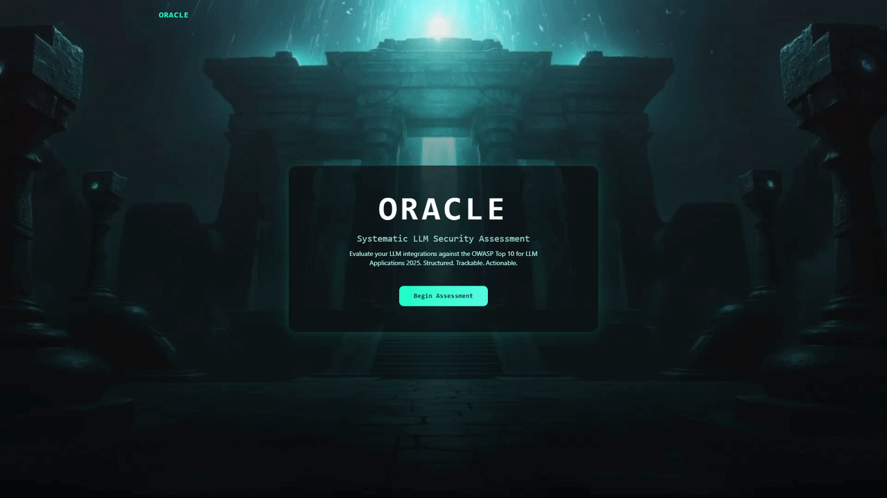

# Oracle

**Live:** [oracle.nfroze.co.uk](https://oracle.nfroze.co.uk)

A guided LLM security assessment framework that translates the OWASP Top 10 for LLM Applications 2025 into a structured workflow of test prompts, mitigation checklists, and a colour-coded risk heatmap.

## Overview

The OWASP Top 10 for LLM Applications is a 50-page specification that most teams never operationalise. Security engineers know they should assess their LLM integrations against it, but the gap between reading the spec and running a structured assessment is wide enough that most skip it entirely.

Oracle bridges that gap. Select which of the 10 risk categories to evaluate, work through 40 pre-built test prompts designed to probe specific vulnerabilities (prompt injection resistance, sensitive information disclosure, system prompt leakage, and seven more), track which of the 40 mitigations your system has implemented, and export the results as a JSON report. The assessment state persists in localStorage, so you can close the browser and pick up where you left off.

This is deliberately not an automated scanner. Prompt injection success depends on model version, temperature, system prompt, and conversation history  -  variables that change between deployments. Oracle provides the structure and the prompts; the engineer provides the judgment. A "pass" means you judged the response secure, not that an algorithm did.

## Architecture

All 10 OWASP categories  -  with their 40 test prompts, 40 attack examples, and 40 mitigations  -  are compiled into approximately 1,000 lines of structured TypeScript at build time. There is no backend. The compliance engine, scoring logic, and persistence layer all run client-side.

The assessment lifecycle moves through four view states: hero, category selection, assessment workspace, and results dashboard. State management uses a custom React hook backed by localStorage, with score recalculation triggered on every test result or mitigation update. The overall mitigation score is the percentage of implemented mitigations across selected categories. The heatmap's per-category overall column averages test pass rate and mitigation implementation rate for a combined view.

The results view includes a custom SVG radial progress indicator and a risk heatmap showing test pass rates and mitigation implementation percentages per category, colour-coded from grey (0%) through red (<50%) to orange (<80%) to green (>=80%).

## Tech Stack

**Frontend**: React 19, TypeScript, Vite 7, Tailwind CSS v4, shadcn/ui (Radix primitives), Lucide icons, Sonner toasts

**Design**: Dark glassmorphism with teal/cyan glow (#00E5C8), JetBrains Mono + Space Grotesk typography, glassmorphic cards with backdrop blur

**Infrastructure**: AWS S3 (static hosting, eu-west-2), Cloudflare (DNS, SSL), Terraform

**Data**: 10 OWASP LLM categories, 40 test prompts, 40 attack examples, 40 mitigations (~1,000 lines of structured TypeScript)

## Key Decisions

- **Guided framework over automated scanner**: Automated pass/fail testing for LLM vulnerabilities produces false confidence. Prompt injection resistance depends on model version, temperature, system prompt, and conversation history  -  none of which a static scanner can account for. Oracle provides structure; the engineer provides judgment.

- **Static TypeScript dataset over backend API**: The OWASP specification updates once per year. Compiling all data into TypeScript at build time eliminates backend costs, latency, database dependencies, and failure modes. A rebuild-and-redeploy for annual updates is a feature, not a limitation.

- **localStorage over server sessions**: Assessment state doesn't need to cross devices or survive browser resets. Keeping it client-side avoids the need for DynamoDB, Lambda, API Gateway, and authentication  -  an entire backend tier removed for a use case that doesn't require it.

## Author

**Noah Frost**

- Website: [noahfrost.co.uk](https://noahfrost.co.uk)
- GitHub: [github.com/nfroze](https://github.com/nfroze)
- LinkedIn: [linkedin.com/in/nfroze](https://linkedin.com/in/nfroze)
